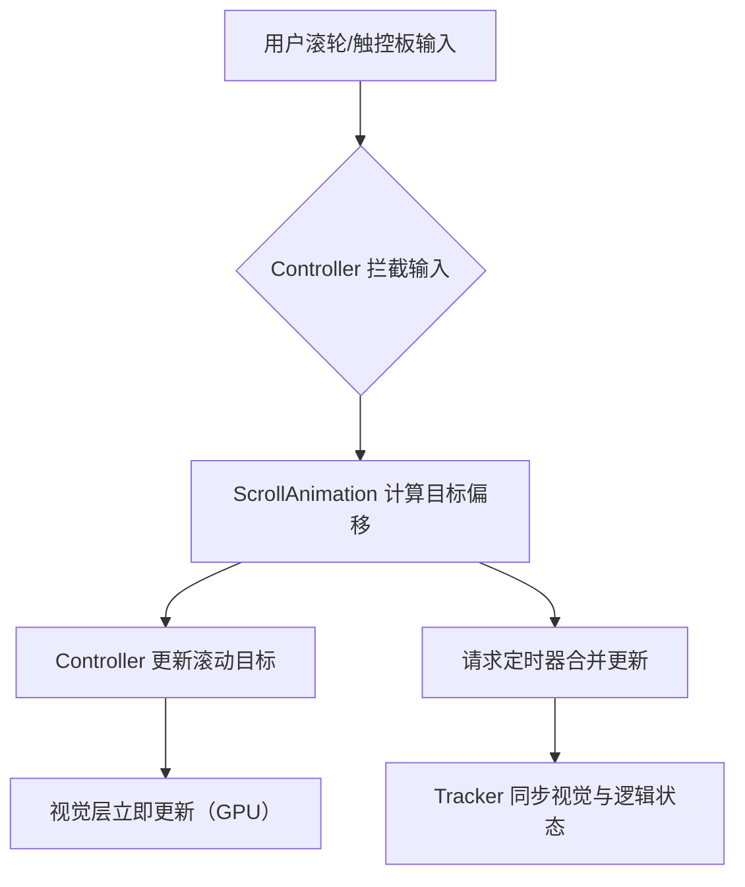

# 🌀 Zen.Scroll

[](https://www.nuget.org/packages/Zen.Wpf.Scroll)
[](https://www.nuget.org/packages/Zen.Wpf.Scroll)

**Zen.Scroll** 是一个轻量级滚动动画功能实现库，为 `ScrollViewer` （以及 `ListView`、`DataGrid`、`GridView` 等包含滚动视图的控件）提供**流畅的滚动动画效果**。通过附加属性以启用滚动动画，让滚动体验更加自然、顺滑，并且支持触控板滚动处理。

## ✨ 功能特性

- 🖱️ 滚轮滚动动画 —— 基于指数衰减模型，模拟物理滑动

- ✋ 触控板滚动 —— 速度灵敏，动态适应的缓动曲线

- 🎛️ 即开即用 —— 仅需一个附加属性即可启用

- ⚡ 高性能 —— GPU 加速的视觉层变换，延迟合并布局更新

- 🧩 无缝集成 —— 基于 `ScrollViewer` 扩展，无需重写布局或更改模板

- 📦 轻量 —— 纯 C# 实现，无额外依赖

---

## 📦 安装

通过 NuGet 包管理器安装：

```bash
dotnet add package Zen.Wpf.Scroll
```
或使用 Visual Studio 的 NuGet 包管理器搜索 `Zen.Wpf.Scroll` 安装

---

## 🚀 快速开始
### 1. 单个 ScrollViewer 启用
``` xml
<Window>
    <ScrollViewer ScrollAnimation.IsEnabled="True">
        <!-- 内容 -->
    </ScrollViewer>
</Window>
```


### 2. 全局启用（所有 `ScrollViewer`）
``` xml
<Application.Resources>
    <Style TargetType="ScrollViewer">
        <Setter Property="ScrollAnimation.IsEnabled" Value="True" />
    </Style>
</Application.Resources>
```

## 3. 代码控制
``` csharp
// 启用/禁用
ScrollAnimation.SetIsEnabled(myScrollViewer, true);

// 检查状态
bool enabled = ScrollAnimation.GetIsEnabled(myScrollViewer);
```

---

## ⚙️ 工作原理（架构概览）

### 双层架构：Controller + Tracker

| 组件 | 职责 |
| ---- | ---- |
| `ScrollAnimationController` | 输入拦截、生命周期管理、动画调度 |
| `ScrollAnimationTracker` | 跟踪滚动状态，驱动内容与滚动条的视觉同步 |

### 调用链：



### 性能优化策略
|  优化点   | 实现方式  |
|  ----  | ----  |
| 视觉层驱动  | 基于内容坐标变换，完全 GPU 加速，依赖 WPF 渲染管线 |
| 延迟合并更新  | 滚动期间，通过低频周期同步动画偏移与布局状态，平衡性能与响应 |
| 双变换同步 | 元素位置与滚动偏移交替变换，实现视觉与逻辑状态双同步 |

---

## 📝 许可证
本项目采用 Apache License 2.0 许可证，详情请参阅 LICENSE 文件。

Enjoy smooth scrolling! 🌀