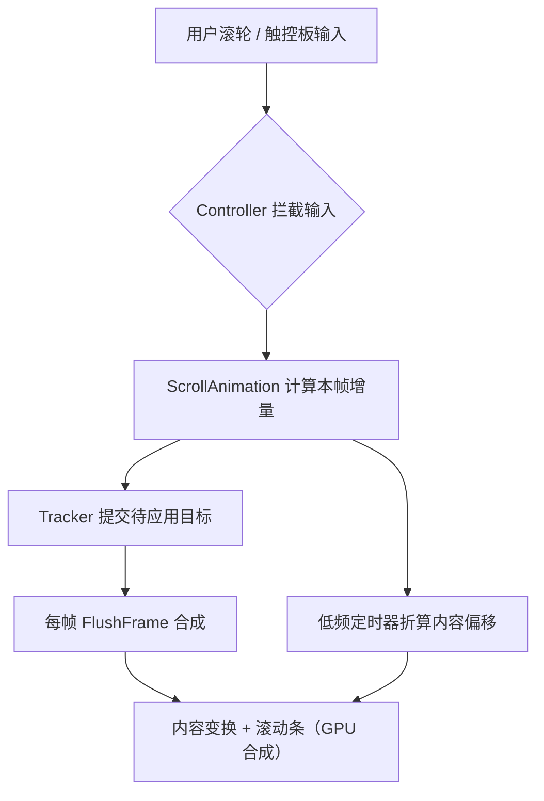

# 🌀 Zen.Scroll

[](https://www.nuget.org/packages/Zen.Wpf.Scroll)
[](https://www.nuget.org/packages/Zen.Wpf.Scroll)

**Zen.Scroll** 是一个 WPF 滚动动画库，为 `ScrollViewer` 及其内部包含 `ScrollViewer` 的控件（`ListView`、`DataGrid`、`GridView` 等）提供滚轮、触控板与缩放的过渡动画。启用方式为在 `ScrollViewer` 上设置 `ScrollAnimation.IsEnabled` 附加属性，不涉及模板与布局的修改。

## ✨ 功能特性

- 🖱️ 滚轮滚动动画 —— 基于指数衰减模型，模拟物理滑动（初速与位移成正比）

- ✋ 触控板滚动 —— 依手势像素速度实时调整缓动曲线与时长

- 🔍 缩放 —— `Ctrl` + 滚轮，以鼠标位置为中心缩放

- 🎚️ 可调参数 —— 滚动步长、时间常数、缩放范围以附加属性配置

- 🎛️ 启用 —— 设置 `ScrollAnimation.IsEnabled` 附加属性，支持 XAML 与代码

- ⚡ 高性能 —— GPU 加速的视觉层变换，延迟合并布局更新

- 🧩 无缝集成 —— 基于 `ScrollViewer` 扩展，无需重写布局或更改模板

- 📦 轻量 —— 纯 C# 实现，无额外依赖

---

## 📦 安装

通过 NuGet 包管理器安装：

```bash
dotnet add package Zen.Wpf.Scroll
```
或使用 Visual Studio 的 NuGet 包管理器搜索 `Zen.Wpf.Scroll` 安装

---

## 🚀 快速开始
### 1. 单个 ScrollViewer 启用
``` xml
<Window>
    <ScrollViewer ScrollAnimation.IsEnabled="True">
        <!-- 内容 -->
    </ScrollViewer>
</Window>
```


### 2. 全局启用（所有 `ScrollViewer`）
``` xml
 <!-- App.xaml -->
<Application.Resources>
    <ResourceDictionary.MergedDictionaries>
        <!-- 通过字典合并的方式，确保其能够正确的覆盖默认样式并应用 -->
        <ResourceDictionary Source="/TemplateStyles.xaml" />
    </ResourceDictionary.MergedDictionaries>
</Application.Resources>

 <!-- TemplateStyles.xaml -->
<ResourceDictionary xmlns="http://schemas.microsoft.com/winfx/2006/xaml/presentation" xmlns:x="http://schemas.microsoft.com/winfx/2006/xaml">
    <Style BasedOn="{StaticResource {x:Type ScrollViewer}}" TargetType="ScrollViewer">
        <Setter Property="ScrollAnimation.IsEnabled" Value="true" />
    </Style>

    <Style
        x:Key="{x:Static GridView.GridViewScrollViewerStyleKey}"
        BasedOn="{StaticResource {x:Static GridView.GridViewScrollViewerStyleKey}}"
        TargetType="{x:Type ScrollViewer}">
        <Setter Property="ScrollAnimation.IsEnabled" Value="true" />
    </Style>
</ResourceDictionary>
```

### 3. 代码控制
``` csharp
// 启用/禁用
ScrollAnimation.SetIsEnabled(myScrollViewer, true);

// 检查状态
bool enabled = ScrollAnimation.GetIsEnabled(myScrollViewer);
```

### 4. 参数调节

``` xml
<Style TargetType="ScrollViewer">
    <Setter Property="ScrollAnimation.IsEnabled" Value="True" />
    <Setter Property="ScrollAnimation.ScrollDelta" Value="100" />
    <Setter Property="ScrollAnimation.ScrollDuration" Value="80" />
    <Setter Property="ScrollAnimation.MinimumScale" Value="1,1" />
    <Setter Property="ScrollAnimation.MaximumScale" Value="10,10" />
    <Setter Property="ScrollAnimation.ZoomDelta" Value="0.2" />
</Style>
```

| 附加属性 | 说明 |
| ---- | ---- | ---- |
| `ScrollDelta` | 每格滚轮的滚动量（像素），负数表示反向滚动 |
| `ScrollDuration` | 滚轮滚动曲线的时间常数（毫秒） |
| `MinimumScale` | 缩放下限 |
| `MaximumScale` | 缩放上限 |
| `ZoomDelta` | `Ctrl` + 滚轮每格的缩放量，负数表示反向缩放 |

> 超出范围的值会被就近修正，参数变更立即生效。

---

## ⚙️ 工作原理（架构概览）

### 分层结构

| 组件 | 职责 |
| ---- | ---- |
| `ScrollAnimation`（`Smooth` / `ZoomAnimationSmooth`） | 计算本帧的滚动/缩放增量，只提交目标，不触碰视觉元素 |
| `ScrollAnimationClient` | 动画只读的宿主契约：滚动/缩放状态与可调参数 |
| `ScrollAnimationController` | 输入拦截、动画生命周期、低频折算定时器、可调参数的缓存与下发 |
| `ScrollAnimationTracker` | 跟踪滚动/缩放状态，合成内容变换与滚动条更新（含可视量 ⇄ 内容量的纯计算） |
| `ContentCache` / `ScrollBarCommandHandler` | 位图缓存管理 / 滚动条命令接管 |

### 调用链：



### 性能优化策略
|  优化点   | 实现方式  |
|  ----  | ----  |
| 视觉层驱动  | 基于内容坐标变换，完全 GPU 加速，依赖 WPF 渲染管线 |
| 延迟合并更新  | 滚动期间，通过低频周期同步动画偏移与布局状态，平衡性能与响应 |
| 双变换同步 | 元素位置与滚动偏移交替变换，实现视觉与逻辑状态双同步 |
| 参数读取 | 可调参数在附加属性变更时推送到控制器缓存，动画与逐帧逻辑只读字段 |

---

## 📝 许可证
本项目采用 Apache License 2.0 许可证，详情请参阅 LICENSE 文件。

Enjoy smooth scrolling! 🌀